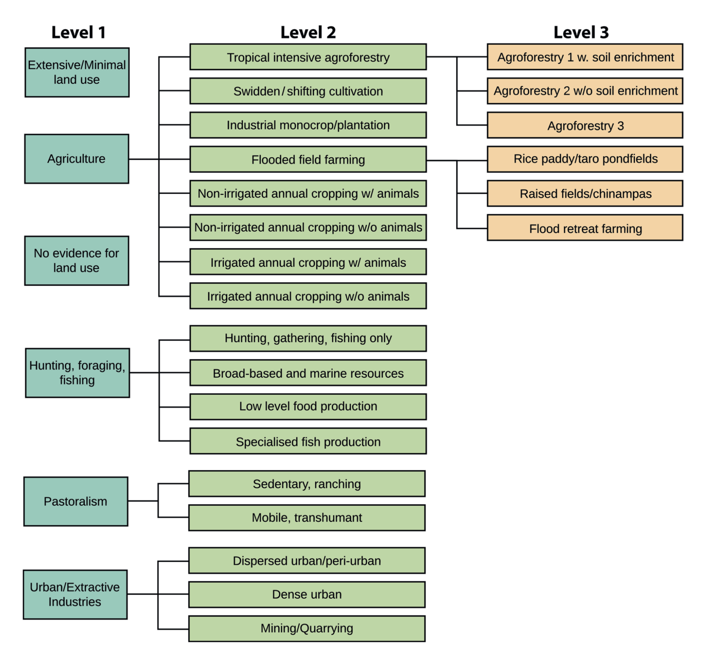

# BGC simulations

## LULC forcing

Four different time-varying input variables have to be provided, covering all time steps and given as maps (gridded fields for longitude and latitude).

1. Cropland area (gridcell fraction).
2. Pasture area (gridcell fraction), 
3. Agricultural system (categorical), 
4. Harvested area (gridcell fraction), defines the (forest) area that is cleared per year.

One additional, temporally constant input variable, also given s map, has to be provided:

5. Land suitability (gridcell fraction), defines the fraction of the gridcell that is suitable for agriculture. Remainder remains primary land. This is used to constrain the maximum extent of secondary land. 

### Cropland area

(Gridcell area fraction)

### Pasture area 

(Gridcell area fraction)

This defines the extent of land that is regularly grazed. Note that naturally open vegetation is assumed to be used before any forest is cleared to satisfy expanding pasture areas.

### Agricultural system

(Categorical)

This is to define Level-2 land use classes after Morrison et al. (2018) (see Figure below) and is to be used as an identifiyer to define a set of land use parameters that characterise typical practices for different agricultural systems. This classification should be "translatable" into information required for the implementation of land use in BGC and ESM models. Required information is:

- Whether croplands are under permanent cultivation (including short rotation fallow, where the ratio of cultivated to fallow land is greater than 1), or under a slash-and-burn type land use. 
- Land turnover rate under slash-and-burn cultivation, defined as the fraction of cropland abandoned each year. Example: If fields are cultivated, e.g., for 5 years and then completely abandoned, the abandonment rate would be 20%.
- Whether or not croplands are irrigated (alleviating all soil moisture limitation in BGC models, and setting annual precipitation on respective land to potential evapotranspiration minus precipitation (PET-P) in ESMs.)
- Whether or not litter inputs are reduced (crop harvesting and off-site decomposition of residues, absence of mulching) and/or soil organic matter decomposition is accelerated by cultivation (e.g., tillage). This information is important for simulating soil C stocks and their responses to land use change.

A lookup table can then be used to associate the Level-2 classification with land use parameters for its implementation in models:

| Level 2 class                       | Permanent cultivation             | Land turnover rate              | Irrigated croplands        | Reduced soil C       |
|-------------------------------------|-----------------------------------|---------------------------------|----------------------------|----------------------|
| Tropical intensive agroforestry     | `TRUE`                            | NA                              | `FALSE`                    | ???                  |
| Swidden / shifting cultivation      | `FALSE`                           | 20% (example)                   | `FALSE`                    | `TRUE`               |

etc.

### Harvested area

# ESM simulations
